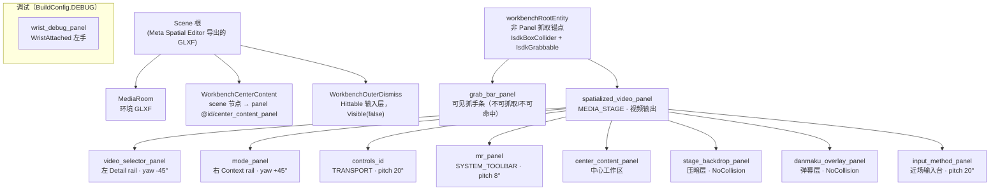
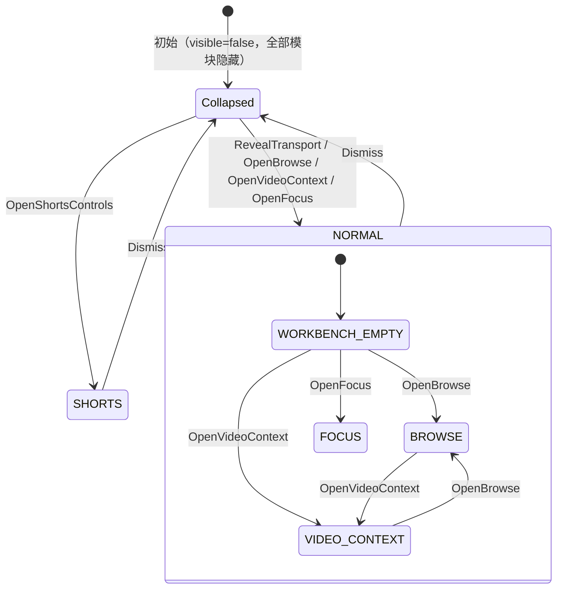
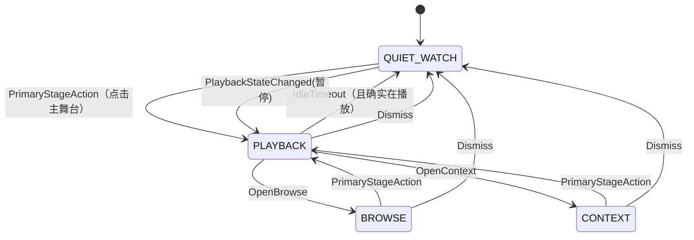
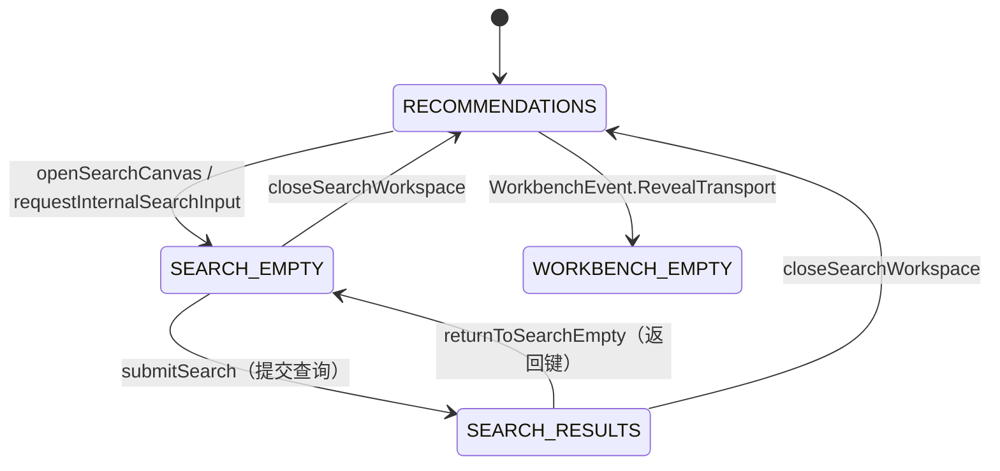

# UI 结构与术语参考（当前实现）

## 文档定位

本文以**当前源码为准**，描述 ViriViri 的 UI 结构层级与对应术语，用于回答三个问题：

1. 界面上看到的一块区域，在代码里叫什么？
2. 它挂在哪个宿主、哪个 Spatial 实体、哪个槽位（slot）下？
3. 它是**已接线到 runtime**，还是只存在于 `spatial-workbench-core` 的**契约层**？

与本文的关系：

| 文档 | 内容 |
| --- | --- |
| 本文 | 当前实现的结构与命名事实 |
| [immersive-ui-low-code-architecture.md](immersive-ui-low-code-architecture.md) | 目标架构与主题系统设计（含大量未实现项） |
| [prototypes/workbench/README.md](prototypes/workbench/README.md) | Web 原型的交互契约与信息层级 |
| [spatial-coordinates.md](spatial-coordinates.md) | 坐标系与正负方向 |

标注约定：

- **[实现]** —— 已在 runtime 生效。
- **[契约]** —— 仅存在于 `spatial-workbench-core` 的类型/枚举，尚未被 runtime 使用。
- **[未接线]** —— runtime 已声明该名称，但没有对应实体或行为。

---

## 1. 宿主层

应用由三个 Activity 宿主与一个 SDK 场景组成，同一个 `ExoPlayer` 贯穿全部输出。

```text
ViriViriApplication
└── appState: ViriViriAppState            # 全局产品状态（唯一）
    └── playerSession: PlayerSession      # 唯一 ExoPlayer + 唯一活动 Surface

宿主（Host）
├── SpatialVideoSampleActivity : AppSystemActivity     # 沉浸式模式宿主（ECS / 面板注册 / 实体树）
│   ├── registerPanels()   -> 声明全部 Spatial panel
│   ├── onSceneReady()     -> 注册 component / system，构建 skydome
│   └── onVRReady()        -> 构建 workbench 实体树与面板父子关系
│
├── PancakeActivity : ComponentActivity                # Horizon OS 2D 窗口
│   └── PancakeScreen()    -> 共享 Compose UI + TextureView 视频输出
│
├── MRPanel : ComponentActivity                        # mr_panel 的内容宿主（Intent panel）
│   └── GlobalNavigation() -> 顶部全局导航 Compose 内容
│
└── MoviePanel : ComponentActivity                     # video_selector_panel 的内容宿主（Activity panel）
    └── ImmersiveLeftPanel() -> 左侧 Detail rail Compose 内容
```

术语对应：

| 术语 | 类型 / 文件 | 说明 |
| --- | --- | --- |
| 沉浸式模式宿主 | `SpatialVideoSampleActivity` | 唯一拥有 ECS 实体树与面板注册的 Activity |
| 2D 窗口宿主 | `PancakeActivity` | Horizon OS `PancakeActivity` 路由；`PancakeScreen` 是它的根 Composable |
| 面板内容宿主 | `MRPanel` / `MoviePanel` | 只承载 Compose 内容，不拥有实体、播放器或 Surface |
| 播放器会话 | `PlayerSession` | 唯一 `ExoPlayer` + `attach2dSurface` / `attachImmersiveSurface` 输出切换 |
| 应用状态 | `ViriViriAppState` | 推荐、选中视频、目的地、搜索工作区、播放参数 |

> 约束：以上任何一层都不得创建第二个播放器、第二个视频 `Surface` 或第二个 MediaStage。
> 详见 `.trellis/spec/frontend/media3-surface-handoff.md`。

---

## 2. Spatial 实体树（沉浸式模式）

### 2.1 实体父子关系

实体在 `onVRReady()` 中按「先锚点、后子节点」的顺序创建，全部面板最终都挂在
`spatialized_video_panel` 之下，从而整体跟随抓取锚点移动。



### 2.2 深度与姿态（stage-local 坐标，单位：米）

深度顺序自视频面向用户递进为：`video (0) → nav/center → transport → keyboard`，
local Z 越负越靠近用户；左右 rail 使用固定 yaw 形成弧形侧翼。数值集中定义在
`WorkbenchLayoutConfig`（`app/src/main/java/.../WorkbenchLayoutConfig.kt`）。

| 实体 | 术语 | 本地位置（x, y, z） | 旋转 | 父节点 |
| --- | --- | --- | --- | --- |
| `workbenchRootEntity` | 工作台锚点 `workbenchRoot` | 世界坐标，抓取条所在高度 | — | Scene |
| `grab_bar_panel` | 抓手条 `grab_bar` | (0, 0, 0) | — | `workbenchRoot` |
| `spatialized_video_panel` | 媒体舞台 `MediaStage` | (0, `currentStageAnchorOffsetY()`, 0) | — | `workbenchRoot` |
| `video_selector_panel` | 左侧 Detail rail | (-`railX`, 0, `railLocalZ`) ≈ (-1.05, 0, -1.05) | yaw `-45°` | MediaStage |
| `mode_panel` | 右侧 Context rail | (+`railX`, 0, `railLocalZ`) ≈ (+1.05, 0, -1.05) | yaw `+45°` | MediaStage |
| `controls_id` | 播放控制 `Transport` | (0, -0.78, -0.66) | pitch `20°` | MediaStage |
| `mr_panel` | 全局导航 / 系统工具条（`PanelSlot.SYSTEM_TOOLBAR`） | (0, 0.72, -0.52) | pitch `8°` | MediaStage |
| `center_content_panel` | 中心工作区（scene 节点 `WorkbenchCenterContent`） | (0, `centerLocalY` = -0.03, -0.52) | 无 | MediaStage |
| `stage_backdrop_panel` | 舞台压暗层 `StageBackdrop` | (0, 0, +0.01) | 无 | MediaStage |
| `danmaku_overlay_panel` | 弹幕层 `DanmakuOverlay` | (0, 0, -0.01) | 无 | MediaStage |
| `input_method_panel` | 输入台（`CinemaInputConsole` 内容） | (0, -0.48, -0.78) | pitch `20°` | MediaStage |
| `wrist_debug_panel` | 手腕调试面板（DEBUG） | 手部局部偏移 | — | 左手（`WristAttached`） |

派生几何：

```text
railX        = centerWidth/2 + railGap + railWidth/2 · cos(railYaw)
railArcRadius= railX / sin(railYaw)
railLocalZ   = -railArcRadius · cos(railYaw)      # 相对 MediaStage 的舞台本地 Z
centerLocalY = centerBottomLocalY + centerHeight/2
```

固定尺寸常量：

```text
centerWidth = 1.50 m     centerHeight = 1.20 m
railWidth   = 0.70 m     leftRailHeight = 0.90 m   rightRailHeight = 0.58 m
railYawDegrees = 45°     stageBackdropAlpha = 0.42
STAGE_WORLD_Z = 2.00 m   STAGE_DEFAULT_WORLD_Y = 2.14 m
```

### 2.3 场景（Meta Spatial Editor）授权部分

固定环境与命中层由 scene 负责，不在 Kotlin 中新增固定实体，节点名为稳定契约：

```text
app/scenes/Composition/Main.scene
├── MediaRoom              -> projref:MediaRoom/Main.metaspatialobj     环境模型
├── WorkbenchCenterContent -> panel '@id/center_content_panel'          中心面板占位
└── WorkbenchOuterDismiss  -> projref:WorkbenchOuterDismiss/...         全屏命中层
```

`WorkbenchOuterDismiss` 在运行时被设为 `Hittable` + `Visible(false)`：它只提供
「点击工作台外部收起」的命中几何，不渲染任何图元。`WorkbenchCenterContent` 在
运行时被 `bindCenterContentPanel()` 重新挂到 MediaStage 并改写
`PanelDimensions`，因此 scene 里授权的尺寸不是最终尺寸。

---

## 3. 面板注册与内容映射

### 3.1 注册表（`registerPanels()`）

| 资源 id | 面板术语 | 注册方式 | 内容实现 | 形制（m） | 显示（dp / dpi） |
| --- | --- | --- | --- | --- | --- |
| `controls_id` | Transport | `LayoutXMLPanelRegistration`(`layout/controls.xml`) | Android View 层 | 1.32 × 0.38 | 460 × 132 @600 |
| `video_selector_panel` | Left Detail rail | `ActivityPanelRegistration`(`MoviePanel`) | `ImmersiveLeftPanel` | 0.70 × 0.90 | 361 × 464 @800 |
| `mode_panel` | Right Context rail | `LayoutXMLPanelRegistration`(`layout/mode_panel.xml`) | Android View 层 | 0.70 × 0.90 | 280 × 464 @600 |
| `mr_panel` | System toolbar / Global nav | `IntentPanelRegistration`(`MRPanel`) | `GlobalNavigation` | 1.24 × 0.30 | 520 × 128 @600 |
| `center_content_panel` | Center workspace | `ComposeViewPanelRegistration` | `ImmersiveCenterContentPanel` | `centerWidth` × `centerHeight` | 768 × 615 @512 |
| `input_method_panel` | Input console | `ComposeViewPanelRegistration` | `ImmersiveInputMethodPanel` | 1.62 × 0.68 | 832 × 348 @512 |
| `stage_backdrop_panel` | Stage backdrop | `ComposeViewPanelRegistration` | `StageBackdrop` | 随舞台缩放 | 1280 × 720 @800 |
| `danmaku_overlay_panel` | Danmaku overlay | `ComposeViewPanelRegistration` | `DanmakuOverlay` | 随舞台缩放 | 1280 × 720 @800 |
| `grab_bar_panel` | Grab bar | `LayoutXMLPanelRegistration`(`layout/grab_bar.xml`) | 图标 + 文案 | `GRAB_BAR_WIDTH_METERS` × `GRAB_BAR_HEIGHT_METERS` | 512 × 56 @600 |
| `wrist_debug_panel` | Wrist debug（仅 DEBUG） | `LayoutXMLPanelRegistration` | 版本号文本 | `WRIST_DEBUG_PANEL_*` | 224 × 80 @1600 |

### 3.2 工作台模块 → 实体 → 槽位

`ImmersiveWorkbenchReducer.modules(state)` 产出可见模块集合，
`applyWorkbenchModules()` 把模块映射到实体，`WorkbenchModule.toPanelSlot()`
再映射到 core 的 `PanelSlot`（用于命中/透明度控制）。

```text
WorkbenchModule      -> 实体                     -> PanelSlot        内容
--------------------------------------------------------------------------------------
NAVIGATION           -> mr_panel                 -> SYSTEM_TOOLBAR   GlobalNavigation
TRANSPORT            -> controls_id              -> TRANSPORT        controls.xml
SHORTS_ACTIONS       -> controls_id              -> TRANSPORT        (SHORTS 呈现，未实现)
DETAIL_RAIL          -> video_selector_panel     -> CONTEXT          ImmersiveLeftPanel
VIDEO_CONTEXT        -> mode_panel               -> CONTEXT          mode_panel.xml
CENTER_CONTENT       -> center_content_panel     -> BROWSE           ImmersiveCenterContentPanel
PLAYBACK_CONFIG      -> (无实体)                 -> SYSTEM_TOOLBAR   [未接线]
(舞台压暗)            -> stage_backdrop_panel     -> MEDIA_STAGE      StageBackdrop
```

可见性由 `SpatialPanelVisibilityController.setVisible(slot, entity, visible)` 统一处理：
先做 `PanelLayerAlpha` 淡入淡出，最后用 `Visible(false)` 移除命中，**隐藏同时关闭命中**。
工作台 UI 面板可见时 alpha 固定为 `1.0`；唯一的半透明层是舞台压暗层。

`shouldShowWorkbenchModule(module, visibleModules, hasDataSource)` 额外约束：
`DETAIL_RAIL` 与 `VIDEO_CONTEXT` 在**没有数据源**时即使被要求也不显示
（`hasDataSource = appState.selected != null`）。

注意 `applyWorkbenchModules()` 的 `moduleEntities` 只覆盖 `NAVIGATION` /
`TRANSPORT` / `DETAIL_RAIL` / `VIDEO_CONTEXT` 四项，`CENTER_CONTENT` 与舞台压暗层
各自单独处理。因此 `SHORTS_ACTIONS` 虽然在 `toPanelSlot()` 里映射到 `TRANSPORT`，
却**没有任何实体会被它点亮**——这是 SHORTS 通路未接入的直接证据。

---

## 4. 状态机

沉浸式模式同时存在三个层次的「状态」，术语极易混淆，必须区分：

| 状态类型 | 类型 | 回答的问题 | 对应 UI |
| --- | --- | --- | --- |
| `ImmersiveWorkbenchState` | app 层产品状态 | 工作台是否展开、哪条内容路径 | 面板整体可见性 |
| `PlaybackCanvas` | core 层运行时交互焦点 | 正常观看时的交互画布 | 槽位请求 |
| `SearchWorkspaceRoute` | app 层内容路由 | 中心工作区显示什么 | 中心面板内容 |

三者关系：`PlaybackCanvas` 的可见槽位经 `ImmersiveWorkbenchHost.applyCanvasSlots()`
适配为 `WorkbenchEvent`，驱动 `ImmersiveWorkbenchState`。

### 4.1 `ImmersiveWorkbenchState`



字段语义（`ImmersiveWorkbenchState.kt`）：

| 字段 | 取值 | 含义 |
| --- | --- | --- |
| `visible` | `Boolean` | 工作台是否整体展开 |
| `presentation` | `NORMAL` / `SHORTS` | 常规横版还是短视频竖版 |
| `content` | `NONE` / `WORKBENCH_EMPTY` / `BROWSE` / `VIDEO_CONTEXT` / `FOCUS` | 中心内容路径 |
| `isPlaybackConfigVisible` | `Boolean` | 播放设置浮层是否展开 |

模块派生规则（当前实现）：

```text
!visible                                  -> {}
NORMAL                                    -> {NAVIGATION, TRANSPORT, DETAIL_RAIL, VIDEO_CONTEXT}
SHORTS                                    -> {NAVIGATION, SHORTS_ACTIONS}
+ content in {WORKBENCH_EMPTY,BROWSE,FOCUS} -> {CENTER_CONTENT}
+ content == VIDEO_CONTEXT                  -> {VIDEO_CONTEXT}
+ isPlaybackConfigVisible                   -> {PLAYBACK_CONFIG}
```

> 注意：`NORMAL` 恒等加入 `DETAIL_RAIL` 与 `VIDEO_CONTEXT`，即左右两条 rail 在任何正常
> 观看状态下都保留（仅受 `hasDataSource` 约束）。这与 `PlaybackCanvas` 的
> `PLAYBACK = {MEDIA_STAGE, TRANSPORT, SYSTEM_TOOLBAR}` 语义**不一致**，见第 7 节第 4 条。

### 4.2 `PlaybackCanvas`（正常观看交互画布）



槽位配方（`PlaybackCanvasReducer.visibleSlots(state, theme)`）：

```text
QUIET_WATCH -> {MEDIA_STAGE}
PLAYBACK    -> {MEDIA_STAGE, TRANSPORT, SYSTEM_TOOLBAR}
BROWSE      -> {MEDIA_STAGE, BROWSE}
CONTEXT     -> {MEDIA_STAGE, CONTEXT}
最终结果     = 上表 ∪ theme 中策略为 PERSISTENT 的槽位
```

Cinema 主题（`CinemaTheme.create()`）当前的策略：

```text
MEDIA_STAGE     = PERSISTENT      TRANSPORT       = AUTO_FADE
SYSTEM_TOOLBAR  = PERSISTENT      BROWSE / CONTEXT / FOCUS  = ON_DEMAND
ACTION_SHEET    = TRANSIENT       SHORTS_DETAILS / SHORTS_COMMENTS = AUTO_FADE
```

因此实战结果等价于 `{MEDIA_STAGE, SYSTEM_TOOLBAR} ∪ 画布自身请求`，
即 `mr_panel` 在任何画布下都不会被淡出隐藏。

### 4.3 `SearchWorkspaceRoute`（中心工作区内容路由）



辅助枚举：

| 枚举 | 取值 | 含义 |
| --- | --- | --- |
| `WorkbenchReturnTarget` | `VIDEO_LIST` / `SEARCH_RESULTS` | `WORKBENCH_EMPTY` 中央返回筹码要回到哪个列表 |
| `SearchTextInputTarget` | `INTERNAL` / `SYSTEM` | 当前查询框由应用内输入法还是系统 IME 接管 |
| `ViriViriDestination` | `RECOMMENDATIONS` / `VIEWER` | 是否已进入观看页 |
| `ImmersiveBrowseCommand` | `RETURN_TO_PLAYBACK` | 观看页回到播放画布的命令通道 |

`ImmersiveBrowseSessionReducer` 负责「浏览中真正选中视频 → 回到播放」这一个转换：
只有当 `session.isActive && canvas == BROWSE && previousDestination != VIEWER && destination == VIEWER`
时才 `returnToPlayback`，避免搜索/浏览时误关工作台。

---

## 5. 面板内容结构

### 5.1 `mr_panel` — 全局导航 GlobalNavigation

```text
GlobalNavigation（Compose，MRPanel 宿主）
└── Column  [圆角导航底 surface, 横 8dp / 纵 3dp]
    └── Row
        ├── Button            "ViriViri"          主页（openHomeCanvas）
        ├── Spacer(weight)    → 右侧动作靠右
        ├── IconButton        Search              搜索（openSearchCanvas）
        ├── IconButton        AccountCircle       账户（enabled = false，未登录）
        ├── IconButton        Settings            设置（enabled = false）
        └── Switch            isMrMode            Passthrough / MR 开关
```

> 路由导航**不在**这里：分类 tab / 搜索栏 / 返回属于中心工作区头部。

### 5.2 `video_selector_panel` — 左 Detail rail

```text
ImmersiveLeftPanel → ImmersiveVideoDetailPanel（Compose，MoviePanel 宿主）
└── WorkbenchPanelShell（无 header）
    ├── Column(weight=1, verticalScroll)          ← 唯一可滚动主体
    │   ├── WorkbenchSection
    │   │   ├── WorkbenchTitle        标题 / "未选择视频"
    │   │   ├── WorkbenchSecondaryText 播放量 · 时长
    │   │   └── WorkbenchActionStrip   [点赞 | 投币 | 收藏]（全部 disabled）
    │   ├── WorkbenchCreatorRow        头像 + 昵称 + "作者投稿入口暂不可用"（disabled）
    │   └── WorkbenchSection
    │       └── WorkbenchSecondaryText "暂无视频简介"
    └── WorkbenchFooterAction  评论     ← 固定底部，不随主体滚动

覆盖层：CommentsUnavailableCollapse
└── WorkbenchFullHeightCollapse("评论")  自底向上铺满整条左 rail
    ├── 标题 "评论服务尚未接入"
    ├── 说明 "回复、点赞和点踩需要登录与已验证的服务接口。"
    └── 行 [回复(禁用)] --- Spacer --- [点踩(禁用)] [点赞(禁用)]
```

### 5.3 `center_content_panel` — 中心工作区

`ImmersiveCenterContentPanel` 固定以 `showViewerContent = false` 调用
`RecommendationPanel`，即**中心面板永远是列表/搜索，不承载视频输出**。

```text
ImmersiveCenterContentPanel → RecommendationPanel → CenterContentWorkspace
└── Column [16dp 内边距, 点击空白 → dismissWorkbench]
    ├── Header（按 route 互斥）
    │   ├── WORKBENCH_EMPTY
    │   │   └── 居中 TextButton   [视频列表] 或 [搜索结果]（openPlaybackReturnRoute）
    │   ├── RECOMMENDATIONS / SEARCH_RESULTS
    │   │   └── VideoListFilterBar
    │   │       ├── 行 1：[返回?] 综合排序 最新发布 最多弹幕 最多收藏 更多筛选 | 刷新/回顶 布局切换
    │   │       └── 行 2（展开或有筛选项时）：日期 不限/今天/本周/本月 · 时长 不限/短片/中等/长视频
    │   └── SEARCH_EMPTY
    │       └── CenterWorkspaceHeader：搜索图标 + 查询筹码 + [键盘] + [语音] + [返回]
    └── Body（按 route 互斥）
        ├── RECOMMENDATIONS / SEARCH_RESULTS
        │   └── VideoListPanel
        │       ├── 网格态：LazyVerticalGrid(3 列) → RecommendationCard
        │       ├── 列表态：LazyColumn → RecommendationRow
        │       └── 尾部：PaginationStatus（加载更多 / 错误 / 没有更多视频）
        └── SEARCH_EMPTY
            └── SearchDiscoveryContent
                ├── 搜索历史（横向标签 + 逐条删除 + 展开/收起）
                └── 热搜（横向标签 + 刷新）

覆盖层：TransientMessageHost（底部居中，FIFO 瞬时消息）
```

卡片构成：

```text
RecommendationCard              RecommendationRow
├── Box 16:9 封面              ├── MediaThumbnailFrame
│   ├── 缩略图（Loading/Failed/Ready） │   └── ContentAccessBadge
│   ├── ContentAccessBadge 左上  ├── 标题
│   └── 时长角标 右下            ├── UP 主
├── 标题（2 行）                └── 时长
├── UP 主
└── 播放量 · 点赞数
```

### 5.4 `mode_panel` — 右 Context rail（当前为媒体状态 + 调试）

```text
mode_panel.xml（ScrollView）
└── LinearLayout [20dp 内边距, 居中]
    ├── current_media_title        标题（immersiveMediaStatus().title，截断 42）
    ├── current_media_detail       副标题（加载中 / 错误 / UP 主，截断 56）
    ├── retry_media_button         重试（仅观看页失败时可见）
    ├── display_ratio_button       "显示比例: {PlaybackDisplayRatio.label}"
    ├── canvas_size_button         "画布大小: {PlaybackCanvasSize.label}"
    ├── Divider
    ├── stage_y_text               "Stage Y: %.2f m"
    ├── danmaku_status             "danmaku: …"
    ├── scale_text / scale_bar     "Scale: %.2f" + 舞台缩放滑杆
    ├── reset_stage_y_button       "Reset Y (stage height)"
    ├── Divider
    ├── curvature_text             目标层 + 三层曲率
    ├── curvature_layer_button     "Next curve target"
    ├── debug_build_label          DEV <git sha>（仅 DEBUG）
    ├── debug_aspect_*             aspect 探针（仅 DEBUG：detail/target/plan/apply）
    └── open_2d_button             "打开 2D 窗口"
```

> 契约里 `PanelSlot.CONTEXT` 的目标内容是「选集 / 相关 / 详情」，当前 `mode_panel`
> 只是占位；见 `.trellis/tasks/09-02-context-rail-right-panel/prd.md`。

### 5.5 `controls_id` — Transport

```text
controls.xml（LinearLayout, toolbar_bg）
├── Row 1 [高 44dp]
│   ├── browse_button      浏览（openBrowseCanvas）
│   ├── back_button        上一个视频（selectAdjacentRecommendation(-1)）
│   ├── play_pause_button  播放 / 暂停
│   ├── forward_button     下一个视频（selectAdjacentRecommendation(1)）
│   ├── Space(12dp)
│   ├── volume_button      音量（点击弹出音量菜单，文本为紧凑标签）
│   ├── quality_button     清晰度（弹出清晰度菜单）
│   └── speed_button       倍速（弹出倍速菜单）
└── Row 2 [高 32dp]
    ├── elapsed_time  当前时间
    ├── seek_bar      进度拖动
    └── duration_time 总时长
```

Transport 没有标题：当前视频标题属于 Context / Detail 内容。
弹出菜单（音量 / 清晰度 / 倍速 / 显示比例 / 画布大小）使用 `PopupMenu`，
同一时刻只允许一个设置浮层。

### 5.6 `input_method_panel` — 近场输入台

仅当 `route == SEARCH_EMPTY && isKeyboardVisible && !isKeyboardDismissed` 时可见，
并且**只渲染不超出候选区所需的候选项**。

```text
ImmersiveInputMethodPanel → SearchInputPanel → CinemaInputConsole（showQueryField = false）
└── SpatialPanelShell（transparentRoot = true）
    ├── header    （此处为空：查询框在中心工作区头部，不在键盘面板内）
    ├── mainArea
    │   ├── 合成区     composition（宽度对齐中列）
    │   ├── 候选条     SearchCandidateStrip：按自然宽度排布 + 右侧展开/收起箭头
    │   │              展开态 → LazyVerticalGrid 覆盖字母区
    │   └── SearchInputMethodBoard（数字列 / 字母列 / 动作列三栏）
    │       ├── 数字列  numberRows：7-8-9-+ / 4-5-6-− / 1-2-3-× / 0-.-=-÷
    │       ├── 字母列  mainRows（字母层）：
    │       │           q w e r t y u i o p
    │       │           a s d f g h j k l
    │       │           [Shift] z x c v b n m [符号]
    │       │           [中/eng] , . [拼音/English(w=4)] ! ? '
    │       │           字母列还会叠加「展开候选」覆盖层
    │       └── 动作列  actionKeys：⌫ / 麦克风 / ↵ / 收起
    └── footer   SearchActions：⌫删除 · 语音 · 系统输入法 · 收起 · [清空输入] · [确定搜索]
                 （动作列非空时改由动作列承担，footer 只渲染动作列）
```

输入法契约（纯 Kotlin，与 UI 无关）：

| 术语 | 类型 | 说明 |
| --- | --- | --- |
| 输入法 | `SearchInputMethod` | `id` / `displayName` / `keyboard` / `reduce` |
| 输入法注册表 | `SearchInputMethodRegistry` | 按 `inputMethodId` 分派，当前仅 `ChinesePinyinQwertyInputMethod` |
| 输入会话 | `SearchInputSession` | `committedText` / `composition` / `candidates` / `language` / `shiftState` / `keyboardLayer` |
| 键盘布局 | `SearchInputKeyboard` | `numberRows` / `mainRows` / `actionKeys` |
| 输入动作 | `SearchInputAction` | `PressKey` / `SelectCandidate` / `Backspace` / `CommitComposition` |
| 候选 | `SearchInputCandidate` | `value` / `label` / `consumedCompositionLength` |
| 语言 / 上档 / 键盘层 | `SearchInputLanguage` / `SearchInputShiftState` / `SearchInputKeyboardLayer` | `CHINESE|ENGLISH` / `OFF|SHIFTED|CAPS_LOCK` / `LETTERS|SYMBOLS` |

### 5.7 舞台覆盖层

```text
stage_backdrop_panel（StageBackdrop）
└── Canvas → drawRect(Color.Black, alpha = 0.42)     工作台出现时压暗 MediaStage

danmaku_overlay_panel（DanmakuOverlay）
└── Canvas → DanmakuCanvasRuntime.advance(playerPosition)
    ├── SCROLLING    12 条泳道，6s 从右向左
    ├── TOP_FIXED     3 条泳道，4s 居中固定于上方 24% 区域
    └── BOTTOM_FIXED  3 条泳道，4s 居中固定于下方 24% 区域
```

两条覆盖层都是 `MeshCollision.NoCollision`，只渲染、不吃射线；
压暗层默认 `Visible(false)`，弹幕层默认 `Visible(true)`。

### 5.8 `grab_bar_panel` — 抓手条

```text
grab_bar.xml（非交互、不可抓取，仅指示）
└── Row [ic_grab_move 图标 24dp] + "握住并拖动屏幕"
```

真正的抓取能力在 `workbenchRootEntity` 上（`IsdkBoxCollider` + `IsdkGrabbable`，
整条横条可抓）；抓手条只是视觉子节点，让用户知道在哪里抓。

相关系统（都在 `onSceneReady()` 注册，位于 `grab_bar_panel` 之外）：

| 系统 | 职责 |
| --- | --- |
| `GrabBarHoverSystem` | 抓手条悬停高亮；仅播放中且 Workbench 收起时淡出 |
| `VideoStageGrabPersistenceSystem` | 监听锚点抓取结束，持久化舞台世界高度（仅 Y） |
| `AnalogMediaStageTuningSystem` | 右摇杆：上/下缩放全部层，左/右弯曲当前曲率目标层 |
| `StageOverlayReshapeSystem` | 等待 `PanelSceneObject` 就绪后重放覆盖层重塑请求 |

> 契约文档中的 `grab-handle` 组件（`CinemaTheme` 的 `cinema-watch-controls` 画布成员）
> 位于 `TRANSPORT` 覆盖层内；当前实现把抓取能力放在
> 锚点实体上，`TRANSPORT` 内没有独立抓手控件。

### 5.9 2D 窗口

```text
PancakeActivity → PancakeScreen（MaterialTheme）
└── Column [背景 #102025, 20dp 内边距]
    ├── Row
    │   ├── Text "ViriViri"
    │   └── Button "Return to immersive"   结束 2D → 标记 OUTPUT_HANDOFF → 回沉浸式
    └── Box(weight = 1)
        └── RecommendationContent(showPlayer = true)
            ├── destination = RECOMMENDATIONS → CenterContentWorkspace（同上 5.3）
            └── destination = VIEWER
                └── Viewer
                    ├── Button "Back to recommendations"
                    ├── Text 标题
                    ├── Text 错误（可选）
                    └── PlayerOutput → AspectRatioTextureView（高 260dp）
                                       配合 calculateTextureViewScale 做 contain 缩放
```

2D 与沉浸式共享同一 `ViriViriUiState` 与同一 `ExoPlayer`，只有输出吞吐不同：
2D 用 `attach2dSurface(TextureView 的 Surface)`，沉浸式用 SDK 面板托管的 Surface。

---

## 6. 术语总表

### 6.1 层级与宿主

| 术语 | 代码 | 状态 |
| --- | --- | --- |
| 沉浸式模式 / immersive mode | `SpatialVideoSampleActivity` | 实现 |
| 2D 窗口 / pancake | `PancakeActivity` + `window_2d` 概念 | 实现 |
| 工作台 / Workbench | `ImmersiveWorkbench*`，`spatial-workbench-*` 模块 | 实现 |
| 面板 / Panel | Meta Spatial SDK `Panel` + `PanelRegistration` | 实现 |
| 面板外壳 / Panel shell | `SpatialPanelShell` / `WorkbenchPanelShell` | 实现 |
| 轨道 / rail | 左右两条 45° 侧翼面板（Detail / Context） | 实现 |

### 6.2 空间与实体

| 术语 | 代码 | 状态 |
| --- | --- | --- |
| 工作台锚点 | `workbenchRootEntity`（`Entity.create`，运行时持有；`R.id.workbench_root` 已声明但未被引用） | 实现 |
| 媒体舞台 / MediaStage | `R.id.spatialized_video_panel` | 实现 |
| 抓手条 / Grab bar | `R.id.grab_bar_panel` | 实现 |
| 舞台压暗层 / Stage backdrop | `R.id.stage_backdrop_panel` + `StageBackdrop()` | 实现 |
| 弹幕层 | `R.id.danmaku_overlay_panel` + `DanmakuOverlay()` | 实现 |
| 外部收起命中层 | scene 节点 `WorkbenchOuterDismiss` | 实现（不渲染） |
| 中心面板 scene 节点 | scene 节点 `WorkbenchCenterContent` | 实现 |
| 手腕调试面板 | `R.id.wrist_debug_panel` + `WristAttached` | 实现（DEBUG） |
| 自定义 ECS 组件 | `SpatializedAudioPanel` / `PanelLayerAlpha` / `WristAttached` | 实现 |

### 6.3 面板与槽位

| 术语 | 代码 | 状态 |
| --- | --- | --- |
| 槽位 / slot | `PanelSlot` | 实现（部分成员未接线） |
| 呈现策略 | `PanelPresentationPolicy` | 契约（由主题驱动） |
| 主题布局 | `ThemeLayout` / `SlotPlacement` | 契约 |
| 主题画布 | `WorkbenchCanvas`（core） | 契约 |
| 组件树 | `ComponentNode` / `ComponentKind` / `ComponentGroup` | 契约 |
| 系统工具模块 | `SystemToolbarModule` / `ToolbarModule` | 契约 |
| 画中画坞 / PiP dock | `PipDock` / `ContentExclusion` | 契约 |

`PanelSlot` 的实际接线情况：

```text
MEDIA_STAGE      <- stage_backdrop_panel（压暗层）
TRANSPORT        <- controls_id
SYSTEM_TOOLBAR   <- mr_panel（NAVIGATION）、PLAYBACK_CONFIG [未接线]
BROWSE           <- center_content_panel（列表 / 搜索）
CONTEXT          <- video_selector_panel（左）与 mode_panel（右）
ACTION_SHEET     <- input_method_panel（输入台）
FOCUS            [契约]
SHORTS_DETAILS   [契约]
SHORTS_COMMENTS  [契约]
```

### 6.4 画布与布局模式

| 术语 | 类型 | 状态 |
| --- | --- | --- |
| 交互画布 | `PlaybackCanvas`（`QUIET_WATCH` / `PLAYBACK` / `BROWSE` / `CONTEXT`） | 实现 |
| 画布状态 | `PlaybackCanvasState` + `PlaybackCanvasEvent` + `PlaybackCanvasReducer` | 实现 |
| 布局模式 | `ImmersiveLayoutMode`（`WATCH` / `FOCUS` / `EDIT` / `SHORTS`） | 契约 |
| 工作台呈现 | `WorkbenchPresentation`（`NORMAL` / `SHORTS`） | 实现（`SHORTS` 通路未实现） |
| 工作台内容 | `WorkbenchContent`（`NONE` / `WORKBENCH_EMPTY` / `BROWSE` / `VIDEO_CONTEXT` / `FOCUS`） | 实现 |
| 工作台模块 | `WorkbenchModule`（7 项） | 实现（`PLAYBACK_CONFIG` / `SHORTS_ACTIONS` 未接线） |
| 工作台事件 | `WorkbenchEvent`（8 项） | 实现 |
| 深度关系 | `SpatialDepthRelation`（`ROOT` / `FRONT_OF_PARENT` / `BEHIND_PARENT`） | 契约 |
| 溢出策略 | `CanvasOverflowPolicy`（`CLIP` / `VISIBLE`） | 契约 |

### 6.5 内容路由

| 术语 | 代码 | 状态 |
| --- | --- | --- |
| 中心工作区路由 | `SearchWorkspaceRoute` | 实现 |
| 返回目标 | `WorkbenchReturnTarget` | 实现 |
| 文本输入目标 | `SearchTextInputTarget` | 实现 |
| 观看目的地 | `ViriViriDestination` | 实现 |
| 浏览会话 | `ImmersiveBrowseSession` + `ImmersiveBrowseSessionReducer` | 实现 |
| 浏览来源 | `PlaybackBrowseOrigin` / `BrowseContinuation` / `BrowseOriginResolver` | 契约 |
| 虚拟消息 | `TransientMessage` / `TransientMessageState` / `TransientMessageSeverity` / `TransientMessageHost` | 实现 |

### 6.6 搜索与输入法

见 5.6 的输入法契约表。补充：

| 术语 | 代码 | 状态 |
| --- | --- | --- |
| 搜索工作区 | `SearchWorkspaceState` | 实现 |
| 拼音词库 | `DefaultOfflinePinyinLexicon` / `BundledPinyinData` | 实现 |
| 候选合成 | `SearchComposition` / `InputCandidate` / `CompositionRange` | 契约 + 实现 |
| 搜索筛选 | `VideoListFilterState` / `VideoListSort` / `VideoListDateFilter` / `VideoListDurationFilter` | 实现 |

### 6.7 播放控制

| 术语 | 代码 | 取值 |
| --- | --- | --- |
| 清晰度 | `PlaybackQuality` | `AUTO` / `360p` / `480p` / `720p` / `1080p` |
| 显示比例 | `PlaybackDisplayRatio` | `Auto` / `16:9` / `4:3` / `1:1` / `9:16` |
| 画布大小 | `PlaybackCanvasSize` | `紧凑 0.82` / `标准 1.00` / `宽大 1.18`（钳制 0.70–1.50） |
| 倍速 | `PlaybackSpeedControl` | 由 `player.playbackParameters.speed` 驱动 |
| 音量 | `PlaybackVolumeControl` | 由 `player.volume` 驱动 |
| 舞台曲率 | `PlaybackStageCurvature`（`Flat` / `Cylinder`） | 半径 1.5–20 m，`Flat` 等价无限半径 |
| 曲率编辑层 | `PlaybackStageCurvatureLayer`（`VIDEO` / `DANMAKU` / `BACKDROP`） | 三层各自独立 |
| 媒体状态 | `ImmersiveMediaStatus` / `immersiveMediaStatus()` | 标题 + 副标题 |

### 6.8 视觉与主题

| 术语 | 代码 | 状态 |
| --- | --- | --- |
| 调色板 | `CinemaPalette`（`DARK` / `LIGHT` / `HIGH_CONTRAST`） | 实现 |
| 颜色角色 | `CinemaColorRole`（13 项） | 实现 |
| 交互态颜色 | `InteractionColors`（hover / pressed / focus / disabled） | 契约 |
| 面板样式 | `WorkbenchPanelStyle` / `DefaultWorkbenchPanelStyle` | 实现 |
| 输入台皮肤 | `InputConsoleStyle` / `InputConsoleSkin` | 实现 |
| 主题 | `SpatialTheme` + `CinemaTheme.create()` | 契约（Cinema fixture） |
| 主题校验 | `ThemeValidator` / `MediaOverlayValidator` | 契约 |
| 内容可访问标记 | `ContentAccess`（`STANDARD` / `CHARGING_EXCLUSIVE`） + `ContentAccessBadge` | 实现 |
| 缩略图容器 | `MediaThumbnailFrame` | 实现 |

### 6.9 弹幕

| 术语 | 代码 | 状态 |
| --- | --- | --- |
| 弹幕事件 | `DanmakuEvent` | 实现 |
| 弹幕泳道族 | `DanmakuLaneFamily`（`SCROLLING` / `TOP_FIXED` / `BOTTOM_FIXED`） | 实现 |
| 泳道调度 | `DanmakuLaneAssignment` / `prepareDanmaku()` / `scheduleDanmakuLanes()`（`DanmakuLaneScheduler.kt`） | 实现 |
| 弹幕运行时 | `DanmakuCanvasRuntime` / `DanmakuStreamSource` / `ActiveDanmaku`（`DanmakuRuntime.kt`） | 实现 |
| 渲染度量 | `DanmakuRenderMetrics` / `DanmakuRenderConfig` | 实现 |
| 数据源 | `parseBilibiliDanmakuXml()` / `buildBilibiliDanmakuEvent()`（`BilibiliDanmaku.kt`）+ `BilibiliDanmakuProto` | 实现 |
| 弹幕模式 | `DanmakuMode`（`OFF` / `FLAT` / `SPATIAL`） | 契约 |

---

## 7. 命名不一致与遗留项

以下问题**只在本文记录，本次不改动**：改名前需先确认场景授权与主题契约。

1. **三套「画布」概念同名不同层**
   `WorkbenchCanvas`（core，主题画布配方）、`PlaybackCanvas`（core，运行时交互焦点）、
   `WorkbenchContent`（app，中心内容路径）语义相近但互不继承，容易误读。
2. **`PanelSlot` 成员与实体并非一一对应**
   `CONTEXT` 同时被左 Detail rail 与右 Context rail 复用；`BROWSE` 实际承载
   中心列表/搜索（而非左侧浏览）；`ACTION_SHEET` 实际承载输入台。
3. **左右 rail 高度常量与实参不一致**
   `WorkbenchLayoutConfig` 有 `rightRailHeight = 0.58f`，但 `modePanelRegistration()`
   使用 `layout.leftRailHeight`（0.90 m）。该常量当前未被消费。
4. **`NORMAL` 恒显双 rail 与 `PlaybackCanvas` 配方冲突**
   `ImmersiveWorkbenchReducer.modules()` 在 `NORMAL` 下无条件加入 `DETAIL_RAIL` 与
   `VIDEO_CONTEXT`，而 `PlaybackCanvasReducer` 的 `QUIET_WATCH`/`PLAYBACK` 并不请求
   `CONTEXT`。两套可见性来源并存，最终可见性由 app 层 reducer 决定。
5. **未接线的 runtime 名称**
   `WorkbenchModule.PLAYBACK_CONFIG`、`WorkbenchModule.SHORTS_ACTIONS`、
   `WorkbenchPresentation.SHORTS`、`WorkbenchContent.FOCUS` 均无对应实体或行为。
6. **未使用的资源**
   `res/layout/window_2d.xml`、`res/layout/debug.xml`、`res/values/ids.xml` 中的
   `debug_panel` 与 `workbench_root` 均无引用（2D 窗口已改为 Compose，调试遥测已并入
   `mode_panel.xml`，锚点实体只由 `workbenchRootEntity` 持有）。
7. **`PanelSlot.FOCUS` / `PanelSlot.SHORTS_DETAILS` / `PanelSlot.SHORTS_COMMENTS`**
   仅被 `CinemaTheme.create()` 的 fixture 引用，未映射到任何实体。
8. **`ImmersiveLayoutMode` 与 `WorkbenchPresentation` 描述同一维度**
   `WATCH`/`SHORTS` 与 `NORMAL`/`SHORTS` 重复表达了「横版 / 竖版」，且
   `ImmersiveLayoutMode` 多了 `FOCUS`/`EDIT`。

---

## 8. 维护约定

1. **改结构先改授权**：新增固定空间面板必须在 Meta Spatial Editor 场景中授权；
   不得用 Kotlin `Entity.create()` 硬编码固定布局。
2. **一次交互只有一个所有者**：panel 回调、外部收起几何、hover/touch 兜底不得
   各自独立执行同一次显示/隐藏转换。
3. **隐藏必须同时关闭命中**：只用 `Visible` + 命中控制，不能用 Compose alpha 代替
   Spatial 面板隐藏。
4. **本文与源码同步**：修改 `PanelSlot`、`WorkbenchModule`、面板注册表、实体树或
   路由枚举时，同步更新本文第 3、4、6 节。
5. **结构变更后验证**：

   ```powershell
   .\scripts\build-windows-debug.ps1
   ```

   纯契约/reducer 变更可先用 `:spatial-workbench-core:test` 与
   `:spatial-workbench-compose:testDebugUnitTest`。
